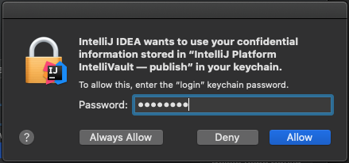

## Supported Versions

The *IntelliVault* plugin supports the following Intellij products:

* Intellij IDEA 2019.1+, Community/Ultimate Editions

## Installation

To install the plugin using the Intellij built-in plugin management dialog by going to **IntelliJ IDEA** > **Preferences...** > **Plugins**.  From there search for "IntelliVault" and choose install.

NOTE: If after installing the plugin and restarting the IDE you don't see the **IntelliVault** option under **Tools** then your version of IDEA is most likely not supported.

## Setting up Vault CLI

IntelliVault uses the [Filevault CLI](https://docs.adobe.com/content/help/en/experience-manager-65/developing/devtools/ht-vlttool.html) under the covers to transfer content between IDEA and your AEM repository.  This is a hard dependency, and requires the user to download and unpack Filevault CLI v3.2+ before you can configure the plugin.

You can download the FileVault CLI from https://repo1.maven.org/maven2/org/apache/jackrabbit/vault/vault-cli/. Be sure you download the binary artifact, version 3.2 or greater, e.g. https://repo1.maven.org/maven2/org/apache/jackrabbit/vault/vault-cli/3.4.2/vault-cli-3.4.2-bin.zip.  Once the download has completed, locate it in your Downloads directory and unpack it to the directory of your choice.

## Configuration

Open the IntelliVault configuration dialog accessible via **IntelliJ IDEA** > **Preferences...** > **Tools** > **IntelliVault** and set the following properties.

- **Vault Directory**: Set this to the directory where you unpacked Filevault, ie. `/Users/myuser/dev/tools/vault/vault-cli-3.4.2/bin`
- **Repository**: See `Multi-Repository Configuration` below
- **Nitpicky Details** These properties are optional and shouldn't require changes under normal operation:
    - **Temp Directory** Where the plugin will store working files. Defaults to the `java.io.tmpdir`
    - **File Ignore Patterns** A comma delimited list of patterns to ignore for VLT operations
    - **JCR Root Directory** The name of the directory within your project corresponding to the JCR Root Node
    - **Show Operation Confirmation Dialogs** When checked, each operation will be confirmed before proceeding
    - **Verbose VLT Output** Passes the verbose flag to VLT when performing operations
    
### Multi-Repository Configuration

IntelliVault allows you to configure and manage multiple repositories to operate against.

For each repo, you must set the following properties:

- **Repository Name**: Unique, friendly name for this repo
- **CRX Repository URL**: URL for the repo, i.e. http://localhost:4502
- **Username**: Username for connecting to the repository, ie. admin
- **Password**: Password used for connecting to the repository, ie. admin

To edit an existing repository, select it from the drop down and edit the value as appropriate before clicking on the "Save Repo Config" button. Likewise, you can delete a repository configuration by selecting it from the drop down and then clicking on "Delete Repo Config" (you will be prompted to confirm).

When you first install the plugin, it will load 2 pre-configured repositories:

- an author instance running on localhost:4502, with the default credentials of admin/admin
- a publish instance running on localhost:4503, with the default credentials of admin/admin

## Usage

The plugin contains only 2 actions, which operate based on the context. To invoke an import or export, right click on any directory which is a sub-directory of jcr_root (or equivalent if you have changed the JCR Root Directory setting). Find the IntelliVault menu, then select either "Pull from CRX..." to export, or "Push to CRX..." to import. If you have more than one repository configured, you will be prompted to select a repository. The last repository selected will always be the default selection for sub-sequent operations. Select the proper repository and click OK to proceed. Then confirm the operation (if Show Operation Confirmation Dialogs is set ot true). You may want to double check that the host, port, path, etc. are all correct before proceeding.

After providing confirmation, Vault will proceed to do it's thing, importing/exporting the content as specified. If something goes wrong, [file a bug](https://github.com/shsteimer/IntelliVault/issues).

### A Note About Credentials

Starting with version 0.11, IntelliVault uses secure storage for credentials.  You may see occasional prompts like the following to allow this storage.

You can manage how IntelliJ stores passwords at **IntelliJ IDEA** > **Preferences...** > **Appearance & Behavior** > **System Settings** > **Passwords**. See [here](https://www.jetbrains.org/intellij/sdk/docs/basics/persisting_sensitive_data.html) for more info.